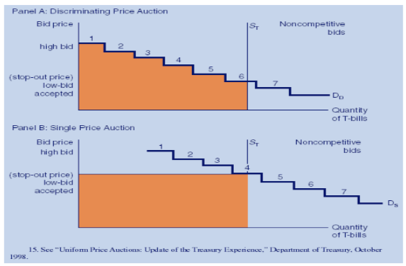
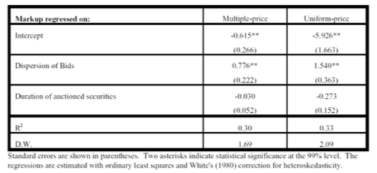
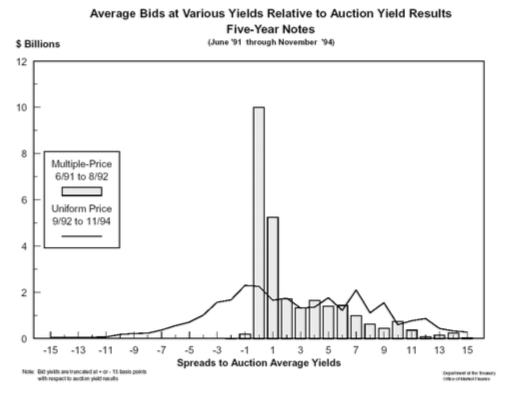
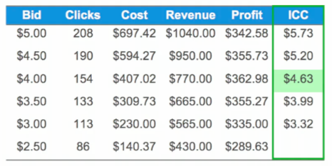
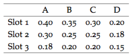
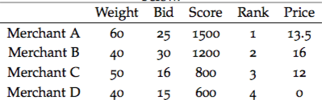

```{r knitr_init, echo=FALSE, cache=FALSE}
PL <- c("knitr", "rmdformats")
new.packages <- PL[!(PL %in% installed.packages())]
if(length(new.packages)) install.packages(new.packages)

library(knitr)
library(rmdformats)

## Global options
options(max.print="75")
opts_chunk$set(echo=TRUE,
	             cache=TRUE,
               prompt=FALSE,
               tidy=TRUE,
               comment=NA,
               message=FALSE,
               warning=FALSE)
opts_knit$set(width=75)
```

# Introduction

Auctions comprise one of the oldest market forms, and are still a popular mechanism for selling various assets and their related price discovery. In this chapter we will study different auction formats, bidding theory, and revenue maximization principles. 

Hal Varian, Chief Economist at Google (NYT, Aug 1, 2002) writes:

"Auctions, one of the oldest ways to buy and sell, have been reborn and revitalized on the Internet.

When I say "old", I mean it. Herodotus described a Babylonian marriage market, circa 500 B.C., in which potential wives were auctioned off. Notably, some of the brides sold for a negative price.

The Romans used auctions for many purposes, including auctioning off the right to collect taxes. In A.D. 193, the Praetorian Guards even auctioned off the Roman empire itself!

We don't see auctions like this anymore (unless you count campaign finance practices), but auctions are used for just about everything else. Online, computer-managed auctions are cheap to run and have become increasingly popular. EBay is the most prominent example, but other, less well-known companies use similar technology."

For a review paper, see: 
http://algo.scu.edu/~sanjivdas/DasSundaram_FMII1996_AuctionTheory.pdf

## Overview

Auctions have many features, but the key ingredient is **information asymmetry** between seller and buyers. The seller may know more about the product than the buyers, and the buyers themselves might have differential information about the item on sale. Moreover, buyers also take into account imperfect information about the behavior of the other bidders. We will examine how this information asymmetry plays into bidding strategy in the mathematical analysis that follows. 

Auction market mechanisms are **explicit**, with the prices and revenue a direct consequence of the auction design. In contrast, in other markets, the interaction of buyers and sellers might be more implicit, as in the case of commodities, where the market mechanism is based on demand and supply, resulting in the implicit, proverbial "invisible hand" setting prices.

There are many *examples* of active auction markets, such as auctions of art and valuables, eBay, Treasury securities, Google ad auctions, and even the New York Stock Exchange, which is an example of a continuous call auction market. 

Auctions may be for a **single unit** (e.g., art) or **multiple units** (e.g., Treasury securities).

# Auction types

The main types of auctions may be classified as follows:

1. English (E): highest bid wins. The auction is open, i.e., bids are revealed to all participants as they occur. This is an ascending price auction.  

2. Dutch (D): auctioneer starts at a high price and calls out successively lower prices. First bidder accepts and wins the auction. Again, bids are open. 

3. 1st price sealed bid (1P): Bids are sealed. Highest bidder wins and pays his price. 

4. 2nd price sealed bid (2P): Same as 1P but the price paid by the winner is the second-highest price. Same as the auction analyzed by William Vickrey in his seminal paper in 1961 that led to a Nobel prize. See \citet{Vickrey}. 

5. Anglo-Dutch (AD): Open, ascending-price auction till only two bidders remain, then it becomes sealed-bid. 

# Value Determination

The eventual outcome of an auction is price/value discovery of the item being sold. There are two characterizations of this value determination process, depending on the nature of the item being sold. 

1. Independent private values model: Each buyer bids his own independent valuation of the item at sale (as in regular art auctions). 

2. Common-values model: Bidders aim to discover a common price, as in Treasury auctions. This is because there is usually an after market in which common value is traded.

# Bidder Types

The assumptions made about the bidders impacts the revenue raised in the auction and the optimal auction design chosen by the seller. We consider two types of bidders. 

1. Symmetric: all bidders observe the same probability distribution of bids and **stop-out** (SP) prices. The stop out price is the price of the lowest winning bid for the last unit sold. This is a robust assumption when markets are competitive. 

2. Asymmetric or non-symmetric. Here the bidders may have different distributions of value. This is often the case when markets are segmented. Example: bidding for firms in merger and acquisition deals. 

# Benchmark Model (BM)

We begin by analyzing what is known as the benchmark model. It is the simplest framework in which we can analyze auctions. It is based on 4 main assumptions:

1. Risk-neutrality of bidders. We do not need utility functions in the analysis. 

2. Private-values model. Every bidder has her own value for the item. There is a distribution of bidders' private values.  

3. Symmetric bidders. Every bidder faces the same distribution of private values mentioned in the previous point. 

4. Payment by winners is a function of bids alone. For a  counterexample, think of payment via royalties for a book contract which depends on post auction outcomes. Or the bidding for movie rights, where the buyer takes a part share of the movie with the seller. 

## Properties of the BM

The following are the results and properties of the BM. 

1. D = 1P. That is, the Dutch auction and first price auction are equivalent to bidders. These two mechanisms are identical because in each the bidder needs to choose how high to bid without knowledge of the other bids. 

2. In the BM, the optimal strategy is to bid one's true valuation. This is easy to see for D and 1P. In both auctions, you do not see any other lower bids, so you bid up to your maximum value, i.e., one's true value, and see if the bid ends up winning. For 2P, if you bid too high you overpay, bid too low you lose, so best to bid one's valuation. For E, it's best to keep bidding till price crosses your valuation (reservation price). 

3. Equilibria types:
- Dominant: A situation where bidders bid their true valuation irrespective of other bidders bids. Satisfied by E and 2P. 
- Nash: Bids are chosen based on the best guess of other bidders' bids. Satisfied by D and 1P. 

# Modeling Auctions

## Auction Math and Stats: Seller's Expected Revenue

We now get away from the abstract definition of different types of auctions and work out an example of an auctions *equilibrium*. 

Let $F$ be the probability distribution of the bids. And define $v_i$ as the true value of the $i$-th bidder, on a continuum between 0 and 1. Assume bidders are ranked in order of their true valuations $v_i$. How do we interpret $F(v)$? Think of the bids as being drawn from say, a beta distribution $F$ on $v \in (0,1)$, so that the probability of a very high or very low bid is lower than a bid around the mean of the distribution. 

The expected difference between the first and second highest bids is, given $v_1$ and $v_2$:

$$
D = [1-F(v_2)](v_1-v_2)
$$

That is, multiply the difference between the first and second bids by the probability that $v_2$ is the second-highest bid. Or think of the probability of there being a bid higher than $v_2$. 
Taking first-order conditions (from the seller's viewpoint):

$$
\frac{\partial D}{\partial v_1} = [1-F(v_1)] - (v_1-v_2)F'(v_1)=0
$$

Note that $v_1 \equiv^d v_2$, given bidders are symmetric in BM. The symbol $\equiv^d$ means "equivalent in distribution". (Definition of equivalence in distribution: $v_1, v_2$ are equivalent in distribution if $Pr[v_1 \leq V] = Pr[v_2 \leq V]$ for all values of $V$.) 

This implies that 

$$
v_1-v_2 = \frac{1-F(v_1)}{f(v_1)}
$$

The expected revenue to the seller is the same as the expected 2nd price (i.e., bounded below by this price). The second price comes from the following re-arranged equation: 

$$
v_2 = v_1 - \frac{1-F(v_1)}{f(v_1)}
$$

## Optimization by bidders

The goal of bidder $i$ is to find a function/bidding rule $B$ that is a function of the private value $v_i$ such that

$$
b_i = B(v_i)
$$

where $b_i$ is the actual bid. If there are $n$ bidders, then

\begin{eqnarray*}
\mbox{Pr}[\mbox{bidder $i$ wins}] &=& \mbox{Pr}[b_i > B(v_j)], \quad \forall j \neq i, \\
&=& [F(B^{-1}(b_i))]^{n-1} 
\end{eqnarray*}

Each bidder tries to maximize her expected profit relative to her true valuation, which is

$$
\pi_i = (v_i - b_i)[F(B^{-1}(b_i))]^{n-1} = (v_i-b_i)[F(v_i)]^{n-1}, \quad \quad (EQN1)
$$

again invoking the notion of bidder symmetry. 
Optimize by taking $\frac{\partial \pi_i}{\partial b_i} = 0$. 
We can get this by taking first the total derivative of profit relative to the bidder's value as follows (noting that $\pi_i[v_i,b_i(v_i)]$ is the full form of the profit function):

$$
\frac{d \pi_i}{d v_i} = \frac{\partial \pi_i}{\partial v_i} + \frac{\partial \pi_i}{\partial b_i}\frac{db_i}{dv_i} =  \frac{\partial \pi_i}{\partial v_i}
$$

which reduces to the partial derivative of profit with respect to personal valuation because $\frac{\partial \pi_i}{\partial b_i} = 0$. This useful first partial derivative is taken from equation (EQN1):

$$
\frac{\partial \pi_i}{\partial v_i} = [F(B^{-1}(b_i))]^{n-1}  = [F(v_i)]^{n-1}
$$

Now, let $v_l$ be the lowest bid. 
Integrate the previous equation to get

$$
\pi_i = \int_{v_l}^{v_i} [F(x)]^{n-1} \; dx  \quad \quad (EQN2)
$$

The previous is derived from the Fundamental Theorem of Calculus which is 

$$
F(x) = \int_{x_l}^x f(u) \; du, \quad \quad 
\int_{v_l}^{v_h} f(u)du = F(v_h) - F(v_l) 
$$

Equating (EQN1) and (EQN2) gives

$$
b_i = v_i - \frac{\int_{v_l}^{v_i} [F(x)]^{n-1} \; dx}{[F(v_i)]^{n-1}} = B(v_i)
$$

which gives the bidding rule $B(v_i)$ entirely in terms of the personal valuation of the bidder. If, for example, $F$ is uniform, then assuming $v \in (0,1)$, note that $F(v)=v$:  
$$
\begin{eqnarray}
b &=& v - \frac{\int_0^v F(x)^{n-1} \;dx}{F(v)^{n-1}} \\
&=& v - \frac{\int_0^v x^{n-1} \;dx}{v^{n-1}} \\
&=& v - \frac{[x^n/n]_0^v}{v^{n-1}} \\
&=& v - \frac{v^n/n}{v^{n-1}}
\end{eqnarray}
$$

resulting in:

$$
b = B(v) = \frac{(n-1)v}{n}
$$

Here we see that we "shade" our bid down slightly from our personal valuation. We bid less than true valuation to leave some room for profit. The amount of shading of our bid depends on how much competition there is, i.e., the number of bidders $n$.  
Note that

$$
\frac{\partial B}{\partial v_i} > 0, \quad \quad \frac{\partial B}{\partial n} > 0
$$

i.e., you increase your bid as your personal value rises, and as the number of bidders increases. 

## Example

We are bidding for a used laptop on eBay. Suppose we assume that the distribution of bids follows a beta distribution with parameters 2,4 and a minimum value \$50 and a maximum value of \$500. Our personal value for the machine is \$300. Assume 10 other bidders. How much should we bid?

```{r}

x = seq(0,1,1/1000)
y = x*450+50
prob_y = dbeta(x,2,4)
print(c("check=",sum(prob_y)/1000)) 
prob_y = prob_y/sum(prob_y)
plot(y,prob_y,type="l")
grid(lwd=3)
```

The beta distribution density function is: 

$Beta(x,a,b) = \frac{\Gamma(a+b)}{\Gamma(a) \Gamma(b)} x^{a-1} (1-x)^{b-1}$

An excellent blog post on the intuition for the beta distribution is here: http://stats.stackexchange.com/questions/47771/what-is-the-intuition-behind-beta-distribution/47782#47782


```{r}

mn = sum(y*prob_y)
print(c("mean=",mn))
```

```{r}

stdev = sqrt(sum(y^2*prob_y)-mn^2)
print(c("stdev=",stdev))
```

Now use a computational approach to solving the problem:

```{r}

x = seq(0,1,1/1000)
y = 50+450*x
cumprob_y = pbeta(x,2,4)
exp_profit = (300-y)*cumprob_y^10
idx = which(exp_profit==max(exp_profit))
print(c("Optimal Bid = ",y[idx]))
print(300*10/11)
```

```{r}
idx
```

```{r}

plot(y[1:550],exp_profit[1:550],type="l")
```

```{r}

#What if there were only 5 other bidders?
exp_profit = (300-y)*cumprob_y^5
idx = which(exp_profit==max(exp_profit))
print(c("Optimal Bid = ",y[idx]))
```

# Treasury Auctions

This section is based on the published paper by Das and Sundaram (1996). We move on from single-unit auctions to a very common multi-unit auction. Treasury auctions are the mechanism by which the Federal government issues its bills, notes, and bonds. Auctions are usually held on Wednesdays. Bids are received up to early afternoon after which the top bidders are given their quantities requested (up to prescribed ceilings for any one bidder), until there is no remaining supply of securities. 

Even before the auction, Treasury securities trade in what is known as a **when-issued** or pre-market. This market gives early indications of price that may lead to tighter clustering of bids in the auction. 

There are two types of dealers in a Treasury auction, primary dealers, i.e., the big banks and investment houses, and smaller independent bidders. The auction is really played out amongst the primary dealers. They place what are known as **competitive** bids versus the others, who place **non-competitive bids**.

Bidders also keep an eye on the secondary market that ensues right after the auction. In many ways, the bidders  are also influenced by the possible prices they expect the paper to be trading at in the secondary market, and indicators of these prices come from the when-issued market. 

The winner in an auction experiences regret, because he knows he bid higher than everyone else, and senses that he overpaid. This phenomenon is known as the **winner's curse**. Treasury auction participants talk amongst each other to mitigate winner's curse. The Fed also talks to primary dealers to mitigate their winner's curse and thereby induce them to bid higher, because someone with lower propensity for regret is likely to bid higher. 

# DPA or UPA?

DPA stands for **discriminating price auction** and UPA for **uniform price auction**. The former was the preferred format for Treasury auctions and the latter was introduced only recently. 

In a DPA, the highest bidder gets his bid quantity at the price he bid. Then the next highest bidder wins his quantity at the price he bid. And so on, until the supply of Treasury securities is exhausted. In this manner the Treasury seeks to maximize revenue by filling each winning at the price. Since the prices paid by each winning bidder are different, the auction is called **discriminating** in price. Revenue maximization is attempted by walking down the demand curve, see Figure below. The shaded area quantifies the revenue raised. 



In a UPA, the highest bidder gets his bid quantity at the price of the last winning bid (this price is also known as the stop-out price). Then the next highest bidder wins his quantity at the stop-out price. And so on, until the supply of Treasury securities is exhausted. Thus, the UPA is also known as a **single-price** auction. See the Figure above, lower panel, where the shaded area quantifies the revenue raised. 

It may intuitively appear that the DPA will raise more revenue, but in fact, empirically, the UPA has been more successful. This is because the UPA incentivizes higher bids, as the winner's curse is mitigated. In a DPA, bids are shaded down on account of winner's curse -- winning means you paid higher than what a large number of other bidders were willing to pay. 

Some countries like Mexico have used the UPA format. The U.S., started with the DPA, and now runs both auction formats. 

An interesting study examined markups achieved over yields in the when-issued market as an indicator of the success of the two auction formats. They examined the auctions of 2- and 5-year notes from June 1991 - 1994). [from Mulvey, Archibald and Flynn, US Office of the Treasury]. See Figure below. 



The results of a regression of the markups on bid dispersion and duration of the auctioned securities shows that markups increase in the dispersion of bids. If we think of bid dispersion as a proxy for the extent of winner's curse, then we can see that the yields are pushed higher in the UPA than the DPA, therefore prices are lower in the UPA than the DPA. Markups are decreasing in the duration of the securities. Bid-Ask spread is shown in the Figure below. 



# Collusion

Here are some examples of collusion in auctions, which can be explicit or implicit. Collusion amongst buyers results in mitigating the winner's curse, and may work to either raise revenues or lower revenues for the seller. 

- (Varian) 1999: German phone spectrum auction. Bids had to be in minimum 10% increments for multiple units. A firm bid 18.18 and 20 million for 2 lots. They signaled that everyone could center at 20 million, which they believed was the fair price. This sort of implicit collusion averts a bidding war. 

- In Treasury auctions, firms can discuss bids, which is encouraged by the Treasury (why?). The restriction on cornering by placing a ceiling on how much of the supply one party can obtain in the auction aids collusion (why?). Repeated games in Treasury security auctions also aids collusion (why?).

- Multiple units also allows punitive behavior, by firms bidding to raise prices on lots they do not want to signal others should not bid on lots they do want. 

# Web Advertising Auctions

The Google AdWords program enables you to create advertisements which will appear on relevant Google search results pages and our network of partner sites. See http://www.adwords.google.com.

The Google AdSense (https://www.google.com/adsense/) program differs in that it delivers Google AdWords ads to individuals' websites. Google then pays web publishers for the ads displayed on their site based on user clicks on ads or on ad impressions, depending on the type of ad.

The material here refers to the elegant paper by Aggarwal, Goel, and Motwani (2006) on keyword auctions in AdWords: 
http://web.stanford.edu/~ashishg/papers/laddered_auction_extended.pdf

We first list some basic features of search engine advertising models. Aggarwal went on to work for Google as they adopted this algorithm from her thesis at Stanford. 

1. Search engine advertising uses three models: (a) CPM, cost per thousand views, (b) CPC, cost per click, and (c) CPA, cost per acquisition. These are all at different stages of the search page experience. 

2. CPC seems to be mostly used. There are 2 models here:
    1. **Direct ranking**: the Overture model. (Price ordering of bidders)
    2. **Revenue ranking**: the Google model. (Revenue ordering, with modifications)

3. The merchant pays the price of the **next** click (different from **second** price auctions). This is non-truthful in both revenue ranking cases as we will see in a subsequent example. That is, bidders will not bid their true private valuations.  

4. Asymmetric: there is an incentive to underbid, none to overbid.

5. Iterative: by placing many bids and watching responses, a bidder can figure out the bid ordering of other bidders for the same keywords, or basket of keywords. However, this is not obvious or simple. Google used to provide the GBS or Google Bid Simulator so that sellers using AdWords can figure out their optimal bids. See the following for more details on Adwords: google.com/adwords/. 

6. If revenue ranking were truthful, it would maximize utility of auctioneer and merchant. (Known as auction **efficiency**).

7. Innovation: the **laddered auction**. Randomized weights attached to bids. If weights are 1, then it's direct ranking. If weights are CTR (click-through rate), i.e. revenue-based, it's the revenue ranking. 

To get some insights about the process of optimal bidding in AdWords auctions, see the Hal Varian video: http://www.youtube.com/watch?v=jRx7AMb6rZ0. 

Three hours version: https://www.youtube.com/watch?v=VqCCAIeW4KY

- Aggarwal, Gagan., Ashish Goel, and Rajeev Motwani (2006). “Truthful Auctions for Price Searching Keywords,” Working paper, Stanford University.

# Quick tutorial on Google Auctions

Here is a quick summary of Hal Varian's video. A merchant can figure out what the maximum bid per click should be in the following steps: 

1. **Maximum profitable CPA**: This is the profit margin on the product. For example, if the selling price is \$300 and cost is \$200, then the profit margin is $100, which is also the maximum cost per acquisition (CPA) a seller would pay. 

2. **Conversion Rate (CR)**: This is the number of times a click results in a sale. Hence, CR is equal to number of sales divided by clicks. So, if for every 100 clicks, we get a sale every 5 times, the CR is 5%.

3. **Value per Click (VPC)**: Equal to the CR times the CPA. In the example, we have $VPC = 0.05 \times 100 = $5$.

4. **Determine the profit maximizing CPC bid**: As the bid is lowered, the number of clicks falls, but the CPC falls as well, revenue falls, but the profit after acquisition costs can rise until the sweet spot is determined. To find the number of clicks expected at each bid price, use the Google Bid Simulator. See the table below (from Google) for the economics at different bid prices. Note that the price you bid is not the price you pay for the click, because it is a **next-price** auction, based on a revenue ranking model, so the exact price you pay is based on Google's model, discussed in the next section. We see that the profit is maximized at a bid of $4. 



Just as an example, note that the profit is equal to 

$$
(VPC - CPC) \times \mbox{#Clicks} = (CPA \times CR- CPC) \times \mbox{#Clicks} 
$$

Hence, for a bid of \$4, we have

$$
(5 - 407.02/154) \times 154 = $362.98
$$

As pointed out by Varian, the rule is to compute ICC (Incremental cost per click), and make sure that it equals the VPC. The ICC at a bid of $5.00 is 

$$
ICC(5.00) = \frac{697.42-594.27}{208-190} = 5.73 > 5
$$

Then

$$
ICC(4.50) = \frac{594.27-407.02}{190-154} = 5.20 > 5
$$

$$
ICC(4.00) = \frac{407.02-309.73}{154-133} = 4.63 < 5
$$

Hence, the optimal bid lies between 4.00 and 4.50. 

```{r}

#GOOGLE CLICK AUCTION MATH
Bid = seq(5,2,-0.5); print(c("Bid:", Bid))
Clicks = c(208,190,154,133,113,86); print(c("Clicks:",Clicks))
Cost = c(697.42,594.27,407.02,309.73,230.00,140.37); 
print(c("Cost:",Cost))
VPC = 5
Revenue = VPC*Clicks; print(c("Revenue = ",Revenue))
Profit = Revenue - Cost; print(c("Profit = ",Profit))
```

# Next Price Auctions

In a next-price auction, the CPC is based on the price of the click next after your own bid. Thus, you do not pay your bid price, but the one in the advertising slot just lower than yours. Hence, if your winning bid is for position $j$ on the search screen, the price paid is that of the winning bid at position $j+1$. 

See the paper by Aggarwal, Goyal and Motwani (2006). Our discussion here is based on their paper. Let the true valuation (revenue) expected by bidder/seller $i$ be equal to $v_i$. The CPC is denoted $p_i$. Let the click-through-rate (CTR) for seller/merchant $i$ at a position $j$ (where the ad shows up on the search screen) be denoted $CTR_{ij}$. $CTR$ is the ratio of the number of clicks to the number of "impressions" i.e., the number of times the ad is shown. 

- The **utility** to the seller is given by 

$$
\mbox{Utility} = CTR_{ij} (v_i-p_i)
$$

- Example: 3 bidders $A$, $B$, $C$, with private values 200, 180, 100. There are two  slots or ad positions with $CTR$s 0.5 and 0.4. If bidder $A$ bids 200, pays 180, utility is $(200-180) \times 0.5=10$. But why not bid 110, for utility of $(200-100) \times 0.4=40$? This simple example shows that the next price auction is not truthful.  Also note that your bid determines your ranking but not the price you pay (CPC). 

- Ranking of bids is based on $w_i b_i$ in descending order of $i$. If $w_i=1$, then we get the Overture direct ranking model. And if $w_i = CTR_{ij}$ then we have Google's original revenue ranking model. In the example below, the weights range from 0 to 100, not 0 to 1, but this is without any loss of generality. The weights assigned to each merchant bidder may be based on some qualitative ranking such as the Quality Score (QS) of the ad. 

- Price paid by bidder $i$ is $\frac{w_{i+1} b_{i+1}}{w_i}$. 

- Separable CTRs: CTRs of merchant $i=1$ and $i=2$ are the same for position $j$. No bidder position dependence. 

# Laddered Auction

AGM 2006 denoted the revised auction as **laddered**. It gives a unique truthful auction. 

Assume $K$ slots, indexed by $j$, and bidders are indexed by $i$. The main idea is to set the CPC to 

$$
p_i = \sum_{j=i}^K \left( \frac{CTR_{i,j}-CTR_{i,j+1}}{CTR_{i,i}}  \right) \frac{w_{j+1} b_{j+1}}{w_i}, \quad 1 \leq i \leq K
$$

so that 

$$
\frac{\#Clicks_i}{\#Impressions_i} \times p_i  = CTR_{ii}\times p_i = \sum_{j=i}^K \left( CTR_{i,j}-CTR_{i,j+1}  \right) \frac{w_{j+1} b_{j+1}}{w_i}
$$

The LHS is the expected revenue to Google per ad impression. Make no mistake, the whole point of the model is to maximize Google's revenue, while making the auction system more effective for merchants. If this new model results in truthful equilibria, it is good for Google. The weights $w_i$ are arbitrary and not known to the merchants. 

Here is the table of $CTR$s for each slot by seller. These tables are the examples in the AGM 2006 paper. 



The assigned weights and the eventual allocations and prices are shown below. 



We can verify these calculations as follows. 

```{r}

p3 = (0.20-0)/0.20 * 40/50 * 15; print(p3)
p2 = (0.25-0.20)/0.25 * 50/40 * 16 + (0.20-0)/0.25 * 40/40 * 15; print(p2)
p1 = (0.40-0.30)/0.40 * 40/60 * 30 + (0.30-0.18)/0.40 * 50/60 * 16 + (0.18-0)/0.40 * 40/60 * 15; p1
```

Note: the bids are no longer in ascending order. The winner of the highest slot may still pay less than the winner of the second slot. But this does maximize revenue to Google. 

See the paper for more details, but this equilibrium is unique and truthful. 

Looking at this model, examine the following questions: 

- What happens to the prices paid when the $CTR$ drop rapidly as we go down the slots versus when they drop slowly? 
- As a merchant, would you prefer that your weight be higher or lower? 
- What is better for Google, a high dispersion in weights, or a low dispersion in weights? 
- Can you see that by watching bidding behavior of the merchants, Google can adjust their weights to maximize revenue? By seeing a week's behavior Google can set weights for the next week. Is this legal? 
- Is Google better off if the bids are more dispersed than when they are close together? How would you use the data in the table above to answer this question using R? 

## Remaining questions to ponder

Whereas Google clearly has modeled their AdWords auction to maximize revenue, less is known about how merchants maximize their net revenue per ad, by designing ads, and choosing keywords in an appropriate manner. Google offers merchants a product called **Google Bid Simulator** so that the return from an adword (key word) may be determined. 

In this exercise, you will first take the time to role play a merchant who is trying to explore and understand AdWords, and then come up with an approach to maximize the return from a portfolio of AdWords. 

Here are some questions that will help in navigating the AdWords landscape. 

1. What is the relation between keywords and cost-per-click (CPC)? 
2. What is the Quality Score (QS) of your ad, and how does it related to keywords and CPC? 
3. What defines success in an ad auction? What are its determinants? %bid amount, quality (Ad Rank)
4. What is AdRank. What does a higher AdRank buy for a merchant? 
5. What are AdGroups and how do they relate to keywords? 
6. What is automated CPC bidding? 
7. What are the following tools? Keyword tool, Traffic estimator, Placement tool, Contextual targeting tool? 
8. What is the incremental cost-per-click (ICC)?

Sketch a brief outline of how you might go about optimizing a portfolio of AdWords. Use the concepts we studied in Markowitz portfolio optimization for this. 

