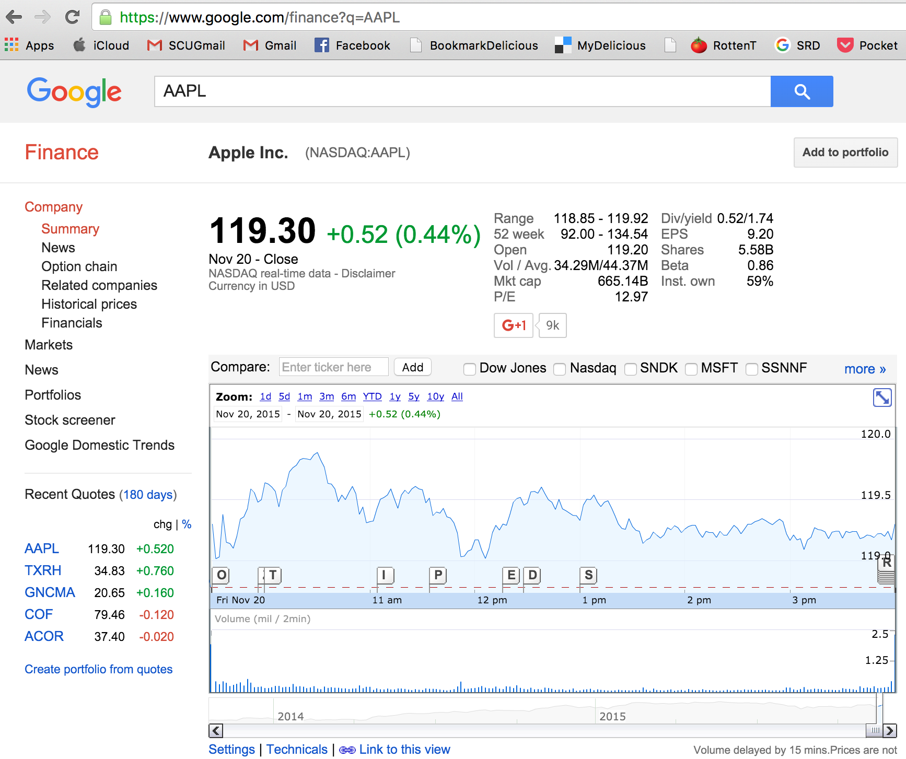
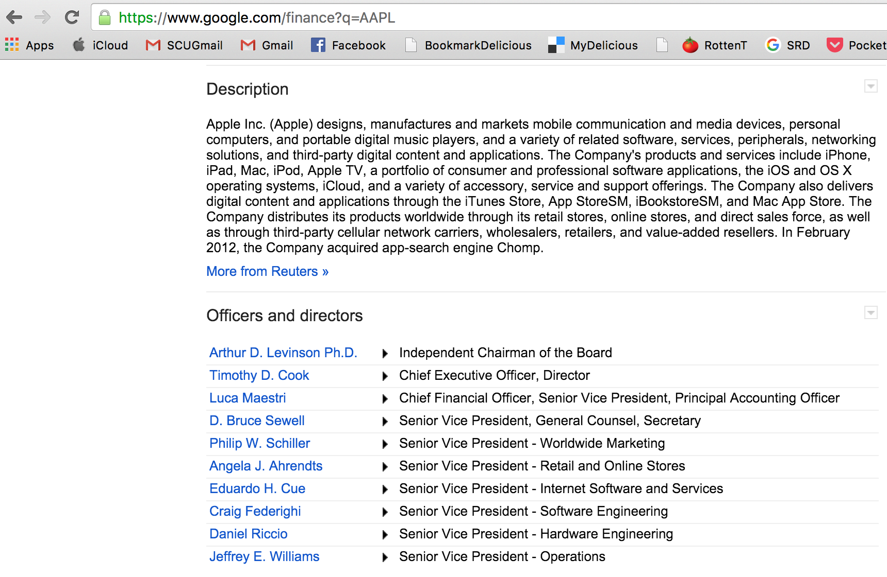
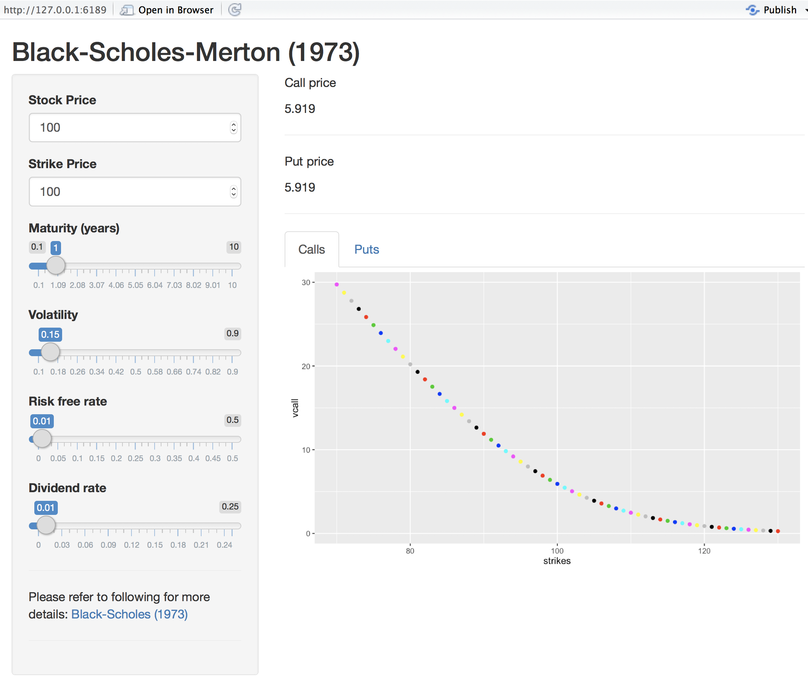
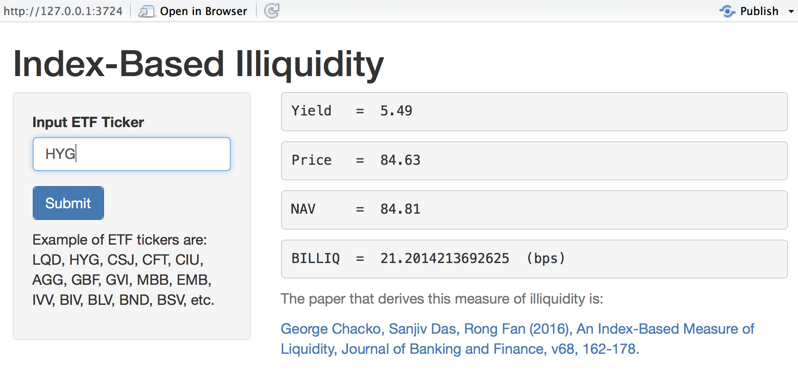

```{r knitr_init, echo=FALSE, cache=FALSE}
library(knitr)
library(rmdformats)

## Global options
options(max.print="75")
opts_chunk$set(echo=TRUE,
	             cache=TRUE,
               prompt=FALSE,
               tidy=TRUE,
               comment=NA,
               message=FALSE,
               warning=FALSE)
opts_knit$set(width=75)
```

## Introduction

In this chapter, we will revisit some of the topics considered in the previous chapters, and demonstrate alternate programming approaches in R. There are some extremely powerful packages in R that allow sql-like operations on data sets, making for advanced data handling. One of the most time-consuming activities in data analytics is cleaning and arranging data, and here we will show examples of many tools available for that purpose. 

Let's assume we have a good working knowledge of R by now. Here we revisit some more packages, functions, and data structures. 

## Data Extraction of stocks using the *quantmod* package

We have seen the package already in the previous chapter. Now, we proceed to use it to get some initial data. 

```{r}
options(warn=-1)

library(quantmod)
tickers = c("AAPL","YHOO","IBM","CSCO","C","GSPC")
getSymbols(tickers)
```

## Print the length of each stock series. 

Are they all the same? Here we need to extract the ticker symbol without quotes.

```{r}
print(head(AAPL))
length(tickers)
```

```{r}
for (t in tickers) {
  a = get(noquote(t))[,1]
  print(c(t,length(a)))
} 
```

We see that they are not all the same. The stock series are all the same length but the S\&P index is shorter by 7 days. 

## Convert closing adjusted prices of all stocks into individual data.frames. 

First, we create a list of data.frames. This will also illustrate how useful lists are because we store data.frames in lists. Notice how we also add a new column to each data.frame so that the dates column may later be used as an index to join the individual stock data.frames into one composite data.frame. 

```{r}
df = list()
j = 0
for (t in tickers) {
  j = j + 1
  a = noquote(t)
  b = data.frame(get(a)[,6])
  b$dt = row.names(b)
  df[[j]] = b
}
```

## Make a single data frame

Second, we combine all the stocks adjusted closing prices into a single data.frame using a join, excluding all dates for which all stocks do not have data. The main function used here is *merge* which could be an intersect join or a union join. The default is the intersect join. 

```{r}
stock_table = df[[1]]
for (j in 2:length(df)) {
  stock_table = merge(stock_table,df[[j]],by="dt")
}
print(dim(stock_table))
class(stock_table)
```

Note that the stock table contains the number of rows of the stock index, which had fewer observations than the individual stocks. So since this is an intersect join, some rows have been dropped. 

## Plot the stock series

Plot all stocks in a single data.frame using ggplot2, which is more advanced than the basic plot function. We use the basic plot function first. 

```{r, fig.fullwidth=TRUE}
par(mfrow=c(3,2))   #Set the plot area to six plots
for (j in 1:length(tickers)) {
  plot(as.Date(stock_table[,1]),stock_table[,j+1], type="l",
       ylab=tickers[j],xlab="date")
}
par(mfrow=c(1,1))  #Set the plot figure back to a single plot
```

## Convert the data into returns 

These are continuously compounded returns, or log returns. 

```{r}
n = length(stock_table[,1])
rets = stock_table[,2:(length(tickers)+1)]
for (j in 1:length(tickers)) {
  rets[2:n,j] = diff(log(rets[,j]))
}
rets$dt = stock_table$dt
rets = rets[2:n,]   #lose the first row when converting to returns
print(head(rets))
class(rets)
```

## Descriptive statistics

The data.frame of returns can be used to present the descriptive statistics of returns.

```{r}
summary(rets)
```

## Correlation matrix 

Now we compute the correlation matrix of returns. 

```{r, fig.fullwidth=TRUE}
cor(rets[,1:length(tickers)])
```

## Correlogram

Show the correlogram for the six return series. This is a useful way to visualize the relationship between all variables in the data set. 

```{r}
library(corrgram)
corrgram(rets[,1:length(tickers)], order=TRUE, lower.panel=panel.ellipse,
 upper.panel=panel.pts, text.panel=panel.txt) 
```

## Market regression

To see the relation between the stocks and the index, run a regression of each of the five stocks on the index returns.

```{r}
betas = NULL
for (j in 1:(length(tickers)-1)) {
  res = lm(rets[,j]~rets[,6])
  betas[j] = res$coefficients[2]
}
print(betas)
```

The $\beta$s indicate the level of systematic risk for each stock. We notice that all the betas are positive, and highly significant. But they are not close to unity, in fact all are lower. This is evidence of misspecification that may arise from the fact that the stocks are in the tech sector and better explanatory power would come from an index that was more relevant to the technology sector. 

## Return versus systematic risk

In order to assess whether in the cross-section, there is a relation between average returns and the systematic risk or $\beta$ of a stock, run a regression of the five average returns on the five betas from the regression. 

```{r}
par(mfrow=c(1,1))
betas = matrix(betas)
avgrets = colMeans(rets[,1:(length(tickers)-1)])
res = lm(avgrets~betas)
print(summary(res))
plot(betas,avgrets)
abline(res,col="red")
```

We see indeed, that there is an unexpected negative relation between $\beta$ and the return levels. This may be on account of the particular small sample we used for illustration here, however, we note that the CAPM (Capital Asset Pricing Model) dictate that we see a positive relation between stock returns and a firm's systematic risk level. 

## Using the *merge* function

Data frames a very much like spreadsheets or tables, but they are also a lot like databases. Some sort of happy medium. If you want to join two dataframes, it is the same a joining two databases. For this R has the **merge** function. It is best illustrated with an example. 

## Extracting online corporate data 

Suppose we have a list of ticker symbols and we want to generate a dataframe with more details on these tickers, especially their sector and the full name of the company. Let's look at the input list of tickers. Suppose I have them in a file called **tickers.csv** where the delimiter is the colon sign. We read this in as follows.

```{r}
tickers = read.table("tickers.csv",header=FALSE,sep=":")
```

The line of code reads in the file and this gives us two columns of data. We can look at the top of the file (first 6 rows). 

```{r}
head(tickers)
```

Note that the ticker symbols relate to stocks from different exchanges, in this case Nasdaq and NYSE. The file may also contain AMEX listed stocks. 

The second line of code below counts the number of input tickers, and the third line of code renames the columns of the dataframe. We need to call the column of ticker symbols as ``Symbol'' because we will see that the dataframe with which we will merge this one also has a column with the same name. This column becomes the index on which the two dataframes are matched and joined. 

```{r}
n = dim(tickers)[1]
print(n)

names(tickers) = c("Exchange","Symbol")
head(tickers)
```

## Get all stock symbols from exchanges

Next, we read in lists of all stocks on Nasdaq, NYSE, and AMEX as follows:

```{r}
library(quantmod) 
nasdaq_names = stockSymbols(exchange="NASDAQ")
nyse_names = stockSymbols(exchange="NYSE")
amex_names = stockSymbols(exchange="AMEX")
```

We can look at the top of the Nasdaq file.

```{r}
head(nasdaq_names)
```

Next we merge all three dataframes for each of the exchanges into one data frame. 

```{r}
co_names = rbind(nyse_names,nasdaq_names,amex_names)
```

To see how many rows are there in this merged file, we check dimensions.

```{r}
dim(co_names)
```

## Feel the merge

Finally, use the merge function to combine the ticker symbols file with the exchanges data to extend the tickers file to include the information from the exchanges file. 

```{r}
result = merge(tickers,co_names,by="Symbol")
head(result)
```

## Web scraping CEO names

Now suppose we want to find the CEOs of these 98 companies. There is no one file with compay CEO listings freely available for download. However, sites like Google Finance have a page for each stock and mention the CEOs name on the page. By writing R code to scrape the data off these pages one by one, we can extract these CEO names and augment the tickers dataframe. The code for this is simple in R. 

```{r}
library(stringr)

#READ IN THE LIST OF TICKERS
tickers = read.table("tickers.csv",header=FALSE,sep=":")
n = dim(tickers)[1]
names(tickers) = c("Exchange","Symbol")
tickers$ceo = NA

#PULL CEO NAMES FROM GOOGLE FINANCE
for (j in 1:n) {
  url = paste("https://www.google.com/finance?q=",tickers[j,2],sep="")
  text = readLines(url)
  idx = grep("Chief Executive",text)
  if (length(idx)>0) {
    tickers[j,3] = str_split(text[idx-2],">")[[1]][2]
  } 
  else {
    tickers[j,3] = NA
  }
  if (j <= 5) print(tickers[j,])   #Print just first 5 names
} 

#WRITE CEO_NAMES TO CSV
write.table(tickers,file="ceo_names.csv",
            row.names=FALSE,sep=",")
```

The code uses the **stringr** package so that string handling is simplified. After extracting the page, we search for the line in which the words ``Chief Executive'' show up, and we note that the name of the CEO appears two lines before in the html page. A sample web page for Apple Inc is shown here: 





The final dataframe with CEO names is shown here (the top 6 lines):

```{r}
head(tickers)
```


## Using the *apply* class of functions

Sometimes we need to apply a function to many cases, and these case parameters may be supplied in a vector, matrix, or list. This is analogous to looping through a set of values to repeat evaluations of a function using different sets of parameters. We illustrate here by computing the mean returns of all stocks in our sample using the **apply** function. The first argument of the function is the data.frame to which it is being applied, the second argument is either 1 (by rows) or 2 (by columns). The third argument is the function being evaluated. 

```{r}
tickers = c("AAPL","YHOO","IBM","CSCO","C","GSPC")
apply(rets[,1:(length(tickers)-1)],2,mean)
```

We see that the function returns the column means of the data set. The variants of the function pertain to what the loop is being applied to. The **lapply** is a function applied to a list, and **sapply** is for matrices and vectors. Likewise, **mapply** uses multiple arguments. 

To cross check, we can simply use the **colMeans** function:
```{r}
colMeans(rets[,1:(length(tickers)-1)])
```
As we see, this result is verified. 

## Getting interest rate data from FRED

In finance, data on interest rates is widely used. An authoritative source of data on interest rates is FRED (Federal Reserve Economic Data), maintained by the St. Louis Federal Reserve Bank, and is warehoused at the following web site:  https://research.stlouisfed.org/fred2/. Let's assume that we want to download the data using R from FRED directly. To do this we need to write some custom code. There used to be a package for this but since the web site changed, it has been updated but does not work properly. Still, see that it is easy to roll your own code quite easily in R. 

```{r}
#FUNCTION TO READ IN CSV FILES FROM FRED
#Enter SeriesID as a text string
readFRED = function(SeriesID) {
  url = paste("https://research.stlouisfed.org/fred2/series/",
          SeriesID, "/downloaddata/",SeriesID,".csv",sep="")
  data = readLines(url)
  n = length(data)
  data = data[2:n]
  n = length(data)
  df = matrix(0,n,2)   #top line is header
  for (j in 1:n) {
    tmp = strsplit(data[j],",")
    df[j,1] = tmp[[1]][1]
    df[j,2] = tmp[[1]][2]
  }
  rate = as.numeric(df[,2])
  idx = which(rate>0)
  idx = setdiff(seq(1,n),idx)
  rate[idx] = -99
  date = df[,1]
  df = data.frame(date,rate)
  names(df)[2] = SeriesID
  result = df
}
```

## Using the custom function

Now, we provide a list of economic time series and download data accordingly using the function above. Note that we also join these individual series using the data as index. We download constant maturity interest rates (yields) starting from a maturity of one month (DGS1MO) to a maturity of thirty years (DGS30). 

```{r}
#EXTRACT TERM STRUCTURE DATA FOR ALL RATES FROM 1 MO to 30 YRS FROM FRED
id_list = c("DGS1MO","DGS3MO","DGS6MO","DGS1","DGS2","DGS3",
            "DGS5","DGS7","DGS10","DGS20","DGS30")
k = 0
for (id in id_list) {
  out = readFRED(id)
  if (k>0) { rates = merge(rates,out,"date",all=TRUE) }
  else { rates = out }
  k = k + 1
}

head(rates)
```

## Organize the data by date

Having done this, we now have a data.frame called **rates** containing all the time series we are interested in. We now convert the dates into numeric strings and sort the data.frame by date. 

```{r}
#CONVERT ALL DATES TO NUMERIC AND SORT BY DATE
dates = rates[,1]
library(stringr)
dates = as.numeric(str_replace_all(dates,"-",""))
res = sort(dates,index.return=TRUE)
for (j in 1:dim(rates)[2]) {
  rates[,j] = rates[res$ix,j]
}

head(rates)
```

## Handling missing values

Note that there are missing values, denoted by **NA**. Also there are rows with "-99" values and we can clean those out too but they represent periods when there was no yield available of that maturity, so we leave this in. 

```{r}
#REMOVE THE NA ROWS
idx = which(rowSums(is.na(rates))==0)
rates2 = rates[idx,]
print(head(rates2))
```


```{r,eval=FALSE,echo=FALSE}
#NELSON-SIEGEL FITTING
t = c(1/12,3/12,6/12,1,2,3,5,7,10,20,30)  #maturities
NS = function(a,b,c,d,t) {
  r = a + b*exp(-t/d) + c*(t/d)*exp(-t/d)
}
```


## Cross-Sectional Data (an example)

1. A great resource for data sets in corporate finance is on Aswath Damodaran's web site, see: 
http://people.stern.nyu.edu/adamodar/New_Home_Page/data.html
2. Financial statement data sets are available at: http://www.sec.gov/dera/data/financial-statement-data-sets.html
3. And another comprehensive data source: 
http://fisher.osu.edu/fin/fdf/osudata.htm
4. Open government data: 
https://www.data.gov/finance/

Let's read in the list of failed banks: 
http://www.fdic.gov/bank/individual/failed/banklist.csv

```{r}
#download.file(url="http://www.fdic.gov/bank/individual/
#failed/banklist.csv",destfile="failed_banks.csv")
```
(This does not work, and has been an issue for a while.)

## Access file from the web using the *readLines* function

You can also read in the data using **readLines** but then further work is required to clean it up, but it works well in downloading the data. 

```{r}
url = "https://www.fdic.gov/bank/individual/failed/banklist.csv"
data = readLines(url)
head(data)
```

## Or, read the file from disk

It may be simpler to just download the data and read it in from the csv file: 
```{r}
data = read.csv("data_files/banklist.csv",header=TRUE)
print(names(data))
```

This gives a data.frame which is easy to work with. We will illustrate some interesting ways in which to manipulate this data. 

## Failed banks by State

Suppose we want to get subtotals of how many banks failed by state. First add a column of ones to the data.frame. 

```{r}
print(head(data))
data$count = 1
print(head(data))
```

## Check for missing data

It's good to check that there is no missing data.
```{r}
any(is.na(data))
```

## Sort by State

Now we sort the data by state to see how many there are. 
```{r}
res = sort(as.matrix(data$ST),index.return=TRUE)
print(head(data[res$ix,]))
print(head(sort(unique(data$ST))))
print(length(unique(data$ST)))
```

## Use the *aggregate* function (for subtotals)

We can directly use the **aggregate** function to get subtotals by state. 

```{r}
head(aggregate(count ~ ST,data,sum),10)
```

## Data by acquiring bank

And another example, subtotal by acquiring bank. Note how we take the subtotals into another data.frame, which is then sorted and returned in order using the index of the sort. 

```{r}
acq = aggregate(count~Acquiring.Institution,data,sum)
idx = sort(as.matrix(acq$count),decreasing=TRUE,index.return=TRUE)$ix
head(acq[idx,],15)
```


## Handling dates with *lubridate*

Suppose we want to take the preceding data.frame of failed banks and aggregate the data by year, or month, etc. In this case, it us useful to use a dates package. Another useful tool developed by Hadley Wickham is the **lubridate** package. 

```{r}
head(data)

library(lubridate)
data$Cdate = dmy(data$Closing.Date)
data$Cyear = year(data$Cdate)
fd = aggregate(count~Cyear,data,sum)
print(fd)

plot(count~Cyear,data=fd,type="l",lwd=3,col="red",xlab="Year")
grid(lwd=3)
```

## By Month

Let's do the same thing by month to see if there is seasonality
```{r}
data$Cmonth = month(data$Cdate)
fd = aggregate(count~Cmonth,data,sum)
print(fd)

plot(count~Cmonth,data=fd,type="l",lwd=3,col="green"); grid(lwd=3)
```

## By Day

There does not appear to be any seasonality. What about day? 

```{r}
data$Cday = day(data$Cdate)
fd = aggregate(count~Cday,data,sum)
print(fd)

plot(count~Cday,data=fd,type="l",lwd=3,col="blue"); grid(lwd=3)
```

Definitely, counts are lower at the start and end of the month! 

## Using the *data.table* package

This is an incredibly useful package that was written by Matt Dowle. It essentially allows your data.frame to operate as a database. It enables very fast handling of massive quantities of data, and much of this technology is now embedded in the IP of the company called h2o: http://h2o.ai/

The data.table cheat sheet is here: https://s3.amazonaws.com/assets.datacamp.com/img/blog/data+table+cheat+sheet.pdf

## California Crime Statistics

We start with some freely downloadable crime data statistics for California. We placed the data in a csv file which is then easy to read in to R. 

```{r}
data = read.csv("data_files/CA_Crimes_Data_2004-2013.csv",header=TRUE)
```

It is easy to convert this into a data.table. 
```{r}
library(data.table)
D_T = as.data.table(data)
print(class(D_T))   
```
Note, it is still a **data.frame** also. Hence, it inherits its properties from the **data.frame** class. 

## Examine the *data.table*

Let's see how it works, noting that the syntax is similar to that for data.frames as much as possible.  We print only a part of the names list. And do not go through each and everyone. 

```{r}
print(dim(D_T))
print(names(D_T))
head(D_T)
```

## Indexing the *data.table*

A nice feature of the data.table is that it can be indexed, i.e., resorted on the fly by making any column in the database the key. Once that is done, then it becomes easy to compute subtotals, and generate plots from these subtotals as well. 

```{r}
setkey(D_T,Year)

crime = 6
res = D_T[,sum(ForRape_sum),by=Year]
print(res)
class(res)
```

See that the type of output is also of the type data.table, and includes the class data.frame also. 

## Plotting from the *data.table*

Next, we plot the results from the **data.table** in the same way as we would for a **data.frame**. 

```{r}
plot(res$Year,res$V1,type="b",lwd=3,col="blue",
	xlab="Year",ylab="Forced Rape")
```

## By County

Repeat the process looking at crime (Rape) totals by county. 

```{r}
setkey(D_T,County)
res = D_T[,sum(ForRape_sum),by=County]
print(res)
setnames(res,"V1","Rapes")

County_Rapes = as.data.table(res)  #This is not really needed
setkey(County_Rapes,Rapes)
print(County_Rapes)
```

## Barplot of crime

Now, we can go ahead and plot it using a different kind of plot, a horizontal barplot. 

```{r, fig.fullwidth=TRUE}
par(las=2)  #makes label horizontal
#par(mar=c(3,4,2,1))  #increase y-axis margins
barplot(County_Rapes$Rapes, names.arg=County_Rapes$County, 
horiz=TRUE, cex.names=0.4, col=8)
```


## Another data set: Bay Area Bike Share data

We show some other features using a different data set, the bike information on Silicon Valley routes for the Bike Share program. This is a much larger data set. 

```{r}
trips = read.csv("data_files/201408_trip_data.csv",header=TRUE)
print(names(trips))
```

## Summarize Trips Data

Next we print some descriptive statistics. 
```{r}
print(length(trips$Trip.ID))
print(summary(trips$Duration/60))
print(mean(trips$Duration/60,trim=0.01))
```

## Start and End Bike Stations

Now, we quickly check how many start and end stations there are. 
```{r}
start_stn = unique(trips$Start.Terminal)
print(sort(start_stn))
print(length(start_stn))
```

```{r}
end_stn = unique(trips$End.Terminal)
print(sort(end_stn))
print(length(end_stn))
```

As we can see, there are quite a few stations in the bike share program where riders can pick up and drop off bikes. The trip duration information is stored in seconds, so has been converted to minutes in the code above. 

## Using the *plyr* package family

This package by Hadley Wickham is useful for applying functions to tables of data, i.e., data.frames. Since we may want to write custom functions, this is a highly useful package. R users often select either the **data.table** or the **plyr** class of packages for handling data.frames as databases. The latest incarnation is the **dplyr** package, which focuses only on data.frames. 

```{r}
require(plyr)
library(dplyr)
```

## Filter the data

One of the useful things you can use is the **filter** function, to subset the rows of the dataset you might want to select for further analysis.
```{r}
res = filter(trips,Start.Terminal==50,End.Terminal==51)
head(res)
```

## Sorting using the *arrange* function

The **arrange** function is useful for sorting by any number of columns as needed. Here we sort by the start and end stations. 

```{r}
trips_sorted = arrange(trips,Start.Station,End.Station)
head(trips_sorted)
```

## Reverse order sort

The sort can also be done in reverse order as follows. 
```{r}
trips_sorted = arrange(trips,desc(Start.Station),End.Station)
head(trips_sorted)
```

## Descriptive statistics

Data.table also offers a fantastic way to do descriptive statistics! First, group the data by start point, and then produce statistics by this group, choosing to count the number of trips starting from each station and the average duration of each trip. 

```{r}
byStartStation = group_by(trips,Start.Station)
res = summarise(byStartStation, count=n(), time=mean(Duration)/60)
print(res)
```

## Other functions in *dplyr*

Try also the **select()**, **extract()**, **mutate()**, **summarise()**, **sample_n()**, **sample_frac()** functions. 

The **group_by()** function is particularly useful as we have seen.


## Interactive applications with *Shiny* (Black-Scholes)

**Shiny** is an R framework in which you can set up browser-based interactive applications and use them to interact with the data. This approach results in a better understanding of models you may build in R. Full documentation and details are available at http://shiny.rstudio.com/

Preparing an application in **Shiny** requires creating the back end processing code, which has to be stored in a file named **server.R** and a front end graphical user interface (GUI), placed in a file named **ui.R**. Both these file names are mandated, as the **shiny** package will look for these files. One may also create a file called **app.R** in which both a *server* function and a *ui* function are embedded. To illustrate, we will create an interactive application to price options using the well-known Black-Scholes-Merton (1973) model. 

## The Black-Scholes-Merton (1973) model

The price of a call option in this model is given by the following formula
$$
C = S e^{-qT} \cdot N(d_1) - K e^{-rT} \cdot N(d_2)
$$
where 
$$ 
d_1 = \frac{\ln(S/K)+(r-q+v^2/2)T}{v \sqrt{T}}
$$
and $d_2 = d_1 - v \sqrt{T}$. Here $S$ is the stock price, $K$ is the strike price, $T$ is option maturity, $v$ is the annualized volatility of the stock, and $r$ is the continuous risk free rate of interest for maturity $T$. Finally, $q$ is the annual dividend rate, assuming it is paid continuously. 

Likewise, the formula for a put option is 
$$
P
= K e^{-rT} \cdot N(-d_2) - S e^{-qT} \cdot N(-d_1) 
$$
and $d_1$ and $d_2$ are the same as for the call option. 

## The application program

Here is the code and it is stored in a file called **app.R**. 

```{r,eval=FALSE}
library(shiny)
library(plotly)
library(ggplot2)


##### SERVER #####

# Define server logic for random distribution application
server <- function(input, output) {
  
  #Generate Black-Scholes values
  BS = function(S,K,T,v,rf,dv) {
    d1 = (log(S/K) + (rf-dv+0.5*v^2)*T)/(v*sqrt(T))
    d2 = d1 - v*sqrt(T)
    bscall = S*exp(-dv*T)*pnorm(d1) - K*exp(-rf*T)*pnorm(d2)
    bsput = -S*exp(-dv*T)*pnorm(-d1) + K*exp(-rf*T)*pnorm(-d2)
    res = c(bscall,bsput)
  }
    
  #Call option price
  output$BScall <- renderText({ 
    #Get inputs
    S = input$stockprice
    K = input$strike
    T = input$maturity
    v = input$volatility
    rf = input$riskfreerate
    dv = input$divrate
    res = round(BS(S,K,T,v,rf,dv)[1],4)
  })

  #Put option price
  output$BSput <- renderText({ 
    #Get inputs
    S = input$stockprice
    K = input$strike
    T = input$maturity
    v = input$volatility
    rf = input$riskfreerate
    dv = input$divrate
    res = round(BS(S,K,T,v,rf,dv)[2],4)
  })

  #Call plot
  output$plotCall <- renderPlot({
    S = input$stockprice
    K = input$strike
    T = input$maturity
    v = input$volatility
    rf = input$riskfreerate
    dv = input$divrate
    vcall = NULL; vput = NULL
    strikes = seq(K-30,K+30)
    for (k in strikes) {
      vcall = c(vcall,BS(S,k,T,v,rf,dv)[1])
      vput = c(vput,BS(S,k,T,v,rf,dv)[2])
    }
    df = data.frame(strikes,vcall,vput)
    ggplot(df,aes(x=strikes,y=vcall)) + geom_point(color=strikes)
  }, height = 350, width = 600)

  #Put plot
  output$plotPut <- renderPlot({
    S = input$stockprice
    K = input$strike
    T = input$maturity
    v = input$volatility
    rf = input$riskfreerate
    dv = input$divrate
    vcall = NULL; vput = NULL
    strikes = seq(K-30,K+30)
    for (k in strikes) {
      vcall = c(vcall,BS(S,k,T,v,rf,dv)[1])
      vput = c(vput,BS(S,k,T,v,rf,dv)[2])
    }
    df = data.frame(strikes,vcall,vput)
    ggplot(df,aes(x=strikes,y=vput)) + geom_point(color=strikes)
  }, height = 350, width = 600)
  
  
}

##### UI #####

ui <- shinyUI(fluidPage(
  
  titlePanel("Black-Scholes-Merton (1973)"),
  
  sidebarLayout(
    sidebarPanel(
      numericInput('stockprice','Stock Price',100),
      numericInput('strike','Strike Price',100),
      sliderInput('maturity','Maturity (years)',min=0.1,max=10,value=1,step=0.01),
      sliderInput('volatility','Volatility',min=0.1,max=0.9,value=0.15,step=0.01),
      sliderInput('riskfreerate','Risk free rate',min=0.0,max=0.5,value=0.01,step=0.01),
      sliderInput('divrate','Dividend rate',min=0.0,max=0.25,value=0.01,step=0.01),
      hr(),
      p('Please refer to following for more details:',
        a("Black-Scholes (1973)", 
          href = "https://en.wikipedia.org/wiki/Black%E2%80%93Scholes_model")),
      hr()
    ),
  
    mainPanel(
      p('Call price'),
      textOutput("BScall"),
      hr(),
      p('Put price'),
      textOutput("BSput"),
      hr(),
      tabsetPanel(
        tabPanel("Calls", plotOutput("plotCall",width="100%")), 
        tabPanel("Puts", plotOutput("plotPut",width="100%")) 
      )
    )
  )  
))

##### Run #####
shinyApp(ui = ui, server = server)
```

## Running the App

To run the app, open the file **app.R** in RStudio and then execute **RunApp** from the menu. This app will generate the following screen. 



1. Note the sidebar panel, that allows numeric input for the stock price and the strike price. 
2. Note also the slider input for the other variables of the model. 
3. Changing the inputs results in automatic interactive updates in the output panel, both to call and put prices, as well as the plots. 
4. Look at the panel with the plots, it has two tabs, and one can click to switch between the plot for calls and the one for puts.

## Server section of the App

The server section has the following features (examine the code above). 

1. The packages used may be invoked at the top of the file, as they may be used by both the server and ui functions. 
2. Each external output is created by a separate function. The text output is carried out by a shiny function called **renderText** and the plots are generated by a function called **renderPlot**. 
3. One may also create subsidiary functions that do not generate external output, but are called by other functions inside the program. For example, the function **BS** in the code above implements the option pricing formula but does not return anything to the UI. 

## UI section of the App

The ui section has the following features (examine the code above). 

1. There are three panels: title, sidebar, main. This allows for a nice layout of inputs and outputs. In the example here, we use the sidebar panel to input values to the app, and the main panel to present outputs. 
2. All inputs are taken in to an object called **input** which is then accessed by the server section of the program. Different formats for the inputs are allowed and here we show numeric and slider inputs as examples. 
3. The output can be tabbed as is done for the plots. 

## Using the *reactive* mode in the app

The ui portion of the program takes input values and makes them available to the server section. We see that each function in the server section has to collect all the inputs for itself, and as a result the initialization of variables in this section occurs inside each function in a repetitive manner. In order to avoid this, and thereby shorten and speed up the code, we may use the inputs in *reactive* mode. What this means is that inputs are live and available globally to all functions in the server segment of the program. 

Here is the **ui.R** file from the reactive version. We see that is much the same as before. 

```{r,eval=FALSE}
##### UI #####
library(shiny)

fluidPage(
  
  titlePanel("Black-Scholes-Merton (1973)"),
  
  sidebarLayout(
    sidebarPanel(
      numericInput('stockprice','Stock Price',100),
      numericInput('strike','Strike Price',100),
      sliderInput('maturity','Maturity (years)',min=0.1,max=10,value=1,step=0.01),
      sliderInput('volatility','Volatility',min=0.1,max=0.9,value=0.15,step=0.01),
      sliderInput('riskfreerate','Risk free rate',min=0.0,max=0.5,value=0.01,step=0.01),
      sliderInput('divrate','Dividend rate',min=0.0,max=0.25,value=0.01,step=0.01),
      hr(),
      p('Please refer to following for more details:',
        a("Black-Scholes (1973)", 
          href = "https://en.wikipedia.org/wiki/Black%E2%80%93Scholes_model")),
      hr()
    ),
    
    mainPanel(
      p('Call price'),
      textOutput("BScall"),
      hr(),
      p('Put price'),
      textOutput("BSput"),
      hr(),
      tabsetPanel(
        tabPanel("Calls", plotOutput("plotCall",width="100%")), 
        tabPanel("Puts", plotOutput("plotPut",width="100%")) 
      )
    )
  )  
)
```

However, the **server.R** file is quite different, and it needed the Black-Scholes pricing funtion **BS** to be refactored to take reactive input, and we were then able to shorten the code considerably, see here. 

```{r,eval=FALSE}
library(shiny)
library(plotly)
library(ggplot2)


##### SERVER #####

# Define server logic for random distribution application
function(input, output) {
  
  #Generate Black-Scholes values
  BS = function(x) {
    S=x[1]; K=x[2]; T=x[3]; v=x[4]; rf=x[5]; dv=x[6]
    d1 = (log(S/K) + (rf-dv+0.5*v^2)*T)/(v*sqrt(T))
    d2 = d1 - v*sqrt(T)
    bscall = S*exp(-dv*T)*pnorm(d1) - K*exp(-rf*T)*pnorm(d2)
    bsput = -S*exp(-dv*T)*pnorm(-d1) + K*exp(-rf*T)*pnorm(-d2)
    res = c(bscall,bsput)
  }
  
  data <- reactive({
    #Get inputs
    matrix(c(input$stockprice,input$strike,input$maturity,
      input$volatility,input$riskfreerate,input$divrate))
  })
  
  #Call option price
  output$BScall <- renderText({ 
    res = round(BS(data())[1],4)
  })
  
  #Put option price
  output$BSput <- renderText({ 
    res = round(BS(data())[2],4)
  })
  
  #Call plot
  output$plotCall <- renderPlot({
    vcall = NULL; vput = NULL
    K = data()[2]
    strikes = seq(K-30,K+30)
    for (k in strikes) {
      d = data(); d[2]=k
      vcall = c(vcall,BS(d)[1])
      vput = c(vput,BS(d)[2])
    }
    df = data.frame(strikes,vcall,vput)
    ggplot(df,aes(x=strikes,y=vcall)) + geom_point(color=strikes)
  }, height = 350, width = 600)
  
  #Put plot
  output$plotPut <- renderPlot({
    vcall = NULL; vput = NULL
    K = data()[2]
    strikes = seq(K-30,K+30)
    for (k in strikes) {
      d = data(); d[2]=k
      vcall = c(vcall,BS(d)[1])
      vput = c(vput,BS(d)[2])
    }
    df = data.frame(strikes,vcall,vput)
    ggplot(df,aes(x=strikes,y=vput)) + geom_point(color=strikes)
  }, height = 350, width = 600)
  
}
```

You can copy this code and create two files in your directory and then run the app to see it execute in exactly the same way as before when reactive inputs were not used. 


## Market Liquidity in Real Time using *Shiny*

In this segment we combine web scraping with *shiny* to create a real time liquidity model. The app is based on the paper by George Chacko, Sanjiv Das, and Rong Fan titled "An Index-Based Measure of Liquidity", published in the *Journal of Banking and Finance*, 2016, v68, 162-178. It is available at: http://algo.scu.edu/~sanjivdas/etfliq.pdf

The main idea of the paper's algorithm is as follows. Since the ETF is usually more liquid than the underlying bonds it represents, any difference in the price of the ETF and the NAV (net asset value) of the underlying bonds must be on account of liquidity, because market risk is otherwise the same for the ETF and its underlying. The paper uses an option pricing based derivation of the illiquidity of the market sector represented by the ETF. This illiquidity is represented in a basis points spread given by the following equation:

$$
BILLIQ = -10000 \ln \left(\frac{NAV}{NAV + |ETF-NAV|}\right)
$$


## Program files

For this application here are the **ui.R** and **server.R** files. You can cut and paste them into separate files in RStudio, and then run the app. 

```{r,eval=FALSE}
#ui.R
library(shiny)

# Define UI for miles per gallon application
shinyUI(pageWithSidebar(
  
  # Application title
  headerPanel("Index-Based Illiquidity"),
  
  sidebarPanel(
    textInput("ticker", "Input ETF Ticker ", ""), 
    submitButton("Submit"),
    p("  "),
    p("Example of ETF tickers are: LQD, HYG, CSJ, CFT, CIU, 
      AGG, GBF, GVI, MBB, EMB, IVV, BIV, BLV, BND, BSV, etc.")
  ),
  
  mainPanel(
    verbatimTextOutput("text4"),
    verbatimTextOutput("text1"),
    verbatimTextOutput("text2"),
    verbatimTextOutput("text3"),
    
    helpText("The paper that derives this measure of illiquidity is:"),
    helpText(a("George Chacko, Sanjiv Das, Rong Fan (2016), 
              An Index-Based Measure of Liquidity, 
              Journal of Banking and Finance, v68, 162-178.",
              href="http://algo.scu.edu/~sanjivdas/etfliq.pdf"))
  )
))
```

```{r,eval=FALSE}
#server.R
library(shiny)

# Define server logic required to plot various variables against mpg
shinyServer(function(input, output) {
  
  observe({
    ## Read in the URL for the ETF ticker
    etf = input$ticker
    url = paste("http://finance.yahoo.com/q?s=",etf,sep="")    
    page = try(readLines(url))
    
    ## Process page for Closing Price
    idx = grep("Prev Close:",page)
    x = page[idx]
    x = unlist(strsplit(x,"Prev Close:"))[2]
    x = unlist(strsplit(as.character(x),"yfnc_tabledata1\">"))[2]
    x = unlist(strsplit(as.character(x),"<"))[1]
    Price = as.numeric(x)
  
    ## Process page for NAV
    x = page[idx]
    x = unlist(strsplit(x,"NAV"))[2]
    x = unlist(strsplit(as.character(x),"yfnc_tabledata1\">"))[2]
    x = unlist(strsplit(as.character(x),"<"))[1]
    NAV = as.numeric(x)
    
    ## Compute BILLIQ
    BILLIQ = -10000*log(NAV/(NAV+abs(Price-NAV)))
    
    ## Process page for Yield
    x = page[idx]
    x = unlist(strsplit(x,"Yield"))[2]
    x = unlist(strsplit(as.character(x),"<yield>"))[2]
    x = unlist(strsplit(as.character(x),"<"))[1]
    Yield = as.numeric(x)
    
    ## Output
    output$text1 = renderText(paste("Price   = ",Price))
    output$text2 = renderText(paste("NAV     = ",NAV))
    output$text3 = renderText(paste("BILLIQ  = ",BILLIQ," (bps)"))
    output$text4 = renderText(paste("Yield   = ",Yield))
    return()
  })
    
})
```

When the app is launched the following interactive screen comes up so one may enter the ETF market for which the liquidity is being computed. 



As one can see, several statistics are provided, after being scraped from the web. The code in **server.R** shows how the information is sourced from the web. 

